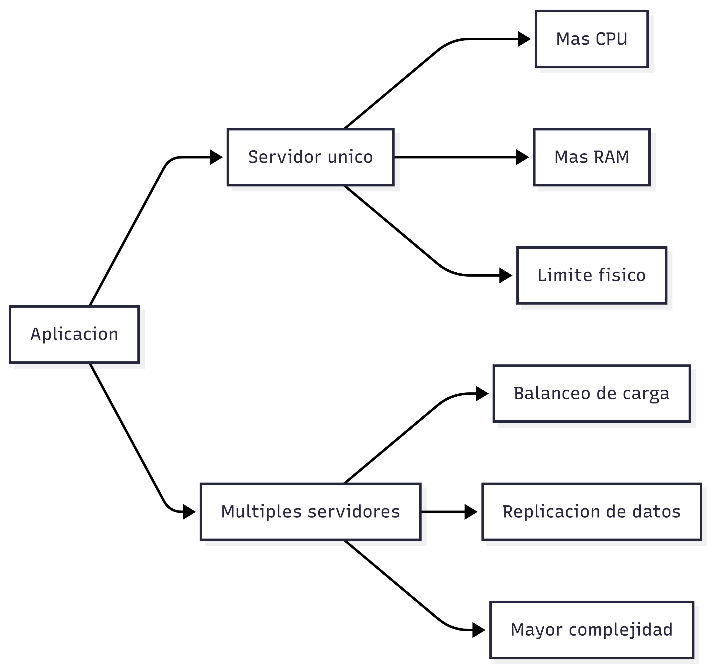

## Problemas reales que aparecen al escalar

Cuando un sistema crece, aparecen limitaciones:

#### Escalabilidad vertical

- Añadir más CPU / RAM: aumentar la capacidad de un único servidor añadiendo más memoria, más potencia de procesamiento o almacenamiento más rápido.
- Es Costoso.
- Tiene un límite físico que no se puede superar indefinidamente.

### Escalabilidad horizontal

- Iimplica distribuir la carga entre múltiples servidores.
- Es muy compleja en BD SQL tradicionales.
- Requiere replicación, sincronización entre nodos y mantenimiento de consistencia.
- Genera problemas de latencia.
- Aumenta la compleijdad operativa.

### Esquemas rígidos

- No adecuada para cambios frecuentes en el modelo de datos.
- Requiere migraciones costosas en tiempo y riesgos.
- Impacto en sistemas en producción

