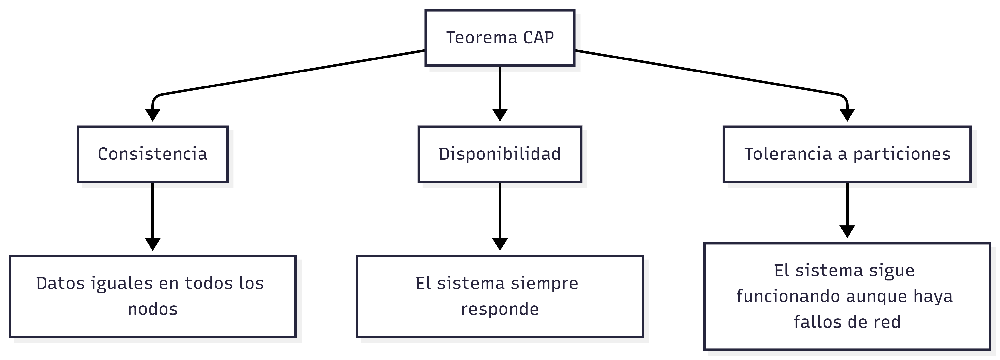

# Características de NoSQL

### ACID vs BASE

### ACID (Relacional)

Las bases de datos relacionales se apoyan en ACID, un conjunto de propiedades que garantizan transacciones seguras y consistentes

- **A**tomicity: Atomicidad implica que una transacción se completa totalmente o no se ejecuta.
- **C**onsistency: Consistencia asegura que los datos siempre cumplen las reglas definidas.
- **I**solation: Aislamiento evita interferencias entre transacciones simultáneas.
- **D**urability: Durabilidad garantiza que los cambios persistan incluso ante fallos del sistema.

✔ Seguridad
✔ Transacciones fuertes
❌ Menor flexibilidad y escalabilidad

### BASE (NoSQL)

- **B**asically  **A**vailable: Este modelo prioriza la disponibilidad del sistema.
- **S**oft state: Permite que el estado de los datos cambie de forma gradual.
- **E**ventual consistency: Busca alcanzar la consistencia eventual

✔ Alta disponibilidad
✔ Escalabilidad
❌ Consistencia inmediata no garantizada

### Teorema CAP

El teorema CAP ayuda a comprender los compromisos que deben hacerse en sistemas distribuidos. Establece que solo se pueden garantizar simultáneamente  **dos de estas tres propiedades**:

- **C**onsistency: La consistencia implica que todos los nodos devuelvan la misma información al mismo tiempo.
- **A**vailability: La disponibilidad asegura que el sistema siempre responda a las solicitudes.
- **P**artition Tolerance: La tolerancia a particiones permite que el sistema continúe funcionando incluso si hay fallos de comunicación entre nodos.

NoSQL acepta **Partition Tolerance** como obligatoria por lo que los sistemas deben equilibrar consistencia y disponibilidad según sus prioridades.

